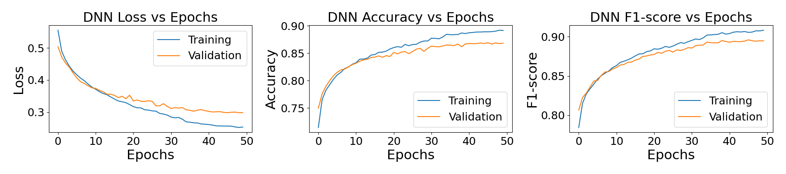

# Machine Learning for Material properties

## General Information
Thermo_stability project trains **Machine Learning (ML) models** to predict **thermodynamic stability** of inorganic crystalll chemical compounds, inspired by [ElemNet](https://www.nature.com/articles/s41598-018-35934-y) paper. The study uses binary classification for various ML methods.

### Dataset Source:
The dataset used are **Next-Gen Materials Project API** from [Materials Project (MPR)](https://next-gen.materialsproject.org/) database. To download dataset, the free api_key was used from MPR.

### Bindary Classification with ML Models:

- **Logistc Regression**
- **Random Forest**
- **Deep Neural Networks (DNN)**

### ML features: 

The ML features used in this study are classified into two categories:

- **Data Extraction** by directly downloading features from MPR database: `nelements, density, energy_per_atom, formation_energy_per_atom, band_gap, cbm, vbm, vpa, magmom_pa`. The last two features (`vpa, magmom_pa`) are computed from volume, total_magnetization descriptor normalized by the nsites. The other
- **Feature Engineering** including *atomic fractions* and *bond structure statistics*. Both sample weight and model weight are applied to DNN and LogisticRegression, whereas only model weight is applied to RandomForest model.

**Split datasets** to train, validation and test in 80-10-10 percent respectively. Split data saved in numpy arrays and pandas dataframes formats. 

For more detail information about the features see [ThermoStability](https://github.com/snabili/Thermo_stability).

### ML Frameworks:
- **Scikit-Learn** for Logistic Regression & Random Forest
- **TensorFlow** for DNN

---

## Technical Details
- *Python Version*: `Python 3.10`
- *Environment Manager*: Conda. Create and activate conda environment:

```bash
conda create -n env_ml
conda activate env_ml
```

### Setting up the Environment:
Required packages to set the environment

```bash
# Install required packages:
pip install tensorflow==2.12.0
pip install scikit-learn
pip install numpy==1.24.3 
pip install pandas
pip install matplotlib
pip install scipy
pip install mp-api
pip install xgboost
pip install seaborn

```

MacOS needs slightly different packages, especially for `tensoflow`. Use `env_ml_macos.yml` file to setup conda environment.

### HTCondor setup

The `bond_structure` function in `common.py` takes a long time (about 36 hours) to run it with one computer. The whole package is in the `condor` folder. First prepare the conda environment to install packages needed to run `bond_structure`

```bash
conda create -n htcon_env -c conda-forge -c defaults python=3.10 numpy=1.26.4 mp-api=0.45.5 pandas=2.2.3 pip
conda activate htcon_env
```

The above packages are added to  `mlenv.yml`. To set up the environment run:

``` conda env create -f env_ml.yml  ```

---
## Code structure:

Thermo_stability project directory tree:

<pre>
├── __init__.py
├── bond_stats
├── directory_tree.txt
├── files
│   ├── bond_stats
│   ├── logs
│   │   ├── dnn_accuracy
│   │   ├── dnn_auc
│   │   ├── dnn_hypertune_mp_accuracy.txt
│   │   ├── dnn_hypertune_auc.txt 
│   │   ├── feature.txt
│   │   ├── plotting.txt
│   │   └── processin.txt
│   ├── MLHypertune_pars
│   │   ├── DNN_hypertune.txt
│   │   └── npzfiles
│   ├── models
│   │   └── MLHypertune_pars
│   └── structures_dict.json
├── scripts
│   ├── bond_structure.sh
│   ├── mp_jobs.sh
│   ├── multiprocessing_hypertune.py
├── test
│   ├── classification_hyperpars.py
│   ├── classification.py
│   ├── data.py
│   ├── dnn_schematic.py
│   ├── pdp_dnnresults.py
│   ├── plotting.py
│   ├── RFLR_perfomance.py
│   └── score_cvauc.py
└── thermo_stability
    ├── __init__.py
    ├── config.py
    ├── creds.py
    ├── feature.py
    ├── processing.py
    └── utils.py
</pre>

Git clone the project:

<pre> git clone https://github.com/snabili/thermo_stability.git </pre>

### Data preparation:
#### 1. API_key
Register with the Materials Project website to directly access to the database via [API_key](https://next-gen.materialsproject.org/api#:~:text=To%20make%20any%20request%20to,old%20one%20on%20your%20dashboard.)

#### 2. Data extraction:
To download features from MPR database:

<pre> python thermo_stability/feature.py data_acquisition </pre>

#### 3. Data Engineering:
To extract `atomic_fraction`:

<pre> python thermo_stability/feature.py atomic_fraction </pre>

The `bond_structure` feature extraction is computationally expensive. The prefered method is to use HighThroughputCondor. Alternatively, multiprocessing tools should be used. The `cpu_time = 181.06 sec`  with 4.0 CPUs to process 1000 datasets. Run the following to extract `bond_structure`:

<pre> bash scripts/bond_structure.sh </pre>

To merge `bond_structure` csv files, and later all features:

```bash
python thermo_stability/feature.py merge_df_structure
python thermo_stability/features.py merge_df_file
```

#### 4. Split datasets:
To split datasets into train, validation, and save to numpy and pandas dataframes:

<pre> python test/data.py </pre>

### ML hyperparameters:
Tunned ML hyperparameters usign GridSearchCV from `sklearn.model_selection` tools from python `scikit-library`. Parameters are tunned for each ML model individually based on maximizing scoring on `auc`. Hypertunning LogistiRegression can be done in an interactive node (`cpu_time=496 sec`) as follow:

<pre> python classification_hyperpars.py LR_hypertune  </pre>

The same command can be used to hypertune RandomForest by replacing `LR_hypertune` with `RF_hypertune` (`cpu_time=159 sec`)

Hypertunning DNN takes more `cpu_time` and `multiprocessing` cores was used. To run DNN hypertunning do:

<pre> python scripts/multiprocessing_hypertune.py  </pre>

The `cpu_time` for DNN run with three CPU cores varies from `1069.02 sec` to `653.09 sec`.

The hyppertuned results are saved into log files, later are called by `classificaton.py`.

### Diagnostic plots
Metrics to make diagnostic plots to assess ML methods performance are the ROC AreaUnderCurve (`auc`), `accuracy`, and `F1-score`. To plot the effect of hyperparamter tuning for RandomForest & LogisticRegression and DNN two python codes are used.

#### RandomForest & LogisticRegression:
An example of how to plot `LogisticRegression` and `RandomForest` hyperparameter results:

```bash
python test/RFLR_perfomance.py --script LR_performance --lr_c 0.001 0.01 0.1 1 10 100
python test/RFLR_perfomance.py --script RF_performance --rf_nest 100 200 300 400 500
```

#### DNN:
To extract the best hyperparameters:

```bash
python test/score_cv.py --dnnmetric dnn_auc
python test/score_cv.py --dnnmetric dnn_accuracy
python test/score_cv.py --dnnmetric dnn_f1score
```
The network chooses almost the same configuration. The output will be saved as text file, extracted by `classification.py` code.

### ML Classification:
To run classification:

```bash
python test/classification.py dnn_classification
python test/classification.py lr_classification
python test/classification.py rf_classification
```

### Plot results:
A decorator is used to plot a specific result. Run this:

<pre> python test/plotting.py dnn_accuracy </pre>

This is the plot:

